# TD Kafka

## Introduction

Dans ce td, J'ai utilisé la plateforme Confluent pour mettre en œuvre un système de gestion de flux de données en temps réel basé sur Apache Kafka.
J'ai choisi Confluent en raison de ses fonctionnalités avancées telles que la gestion des erreurs, la scalabilité, la gestion des performances et la fiabilité.

## Objectif:

L'objectif de ce projet était de mettre en œuvre une solution pour gérer les données en temps réel en utilisant
Confluent. J'ai utilisé un modèle de produit-consommateur pour transférer les données d'une source **Postgres** à un
autre. J'ai utilisé la bibliothèque Kafka Streams pour transformer et joindre les données en temps réel.

## Confluent

J'ai utilisé docker compose pour mettre en place un environnement de développement local pour Confluent.

* [String Docker file](docker-compose1.yml) - pour créer un cluster Kafka avec des données de type String pour la
  première question
* [Avro Docker file](docker-compose2.yml) - pour créer un cluster Kafka avec des données de type Avro avec confluent
  pour la deuxième question

> Il ne faut pas utiliser les deux docker compose en même temps, car ils utilisent le même port et le même nom de
> service.
> Il faut choisir un seul docker compose pour la première ou la deuxième question.

lancer le docker compose:

```bash
docker-compose -f docker-compose1.yml up -d
docker-compose -f docker-compose2.yml up -d
```

arrêter le docker compose:

```bash
docker-compose -f docker-compose1.yml down
docker-compose -f docker-compose2.yml down
```

```docker-compose1.yml``` contient les services suivants: [docker-compose file](docker-compose1.yml)

* Zookeeper - pour la coordination
* Kafka - pour la gestion des données

**docker-compose2.yml** contient les services de confluent suivants: [docker-compose file](docker-compose2.yml)

* Zookeeper - pour la coordination
* Kafka - pour la gestion des données
* Schema Registry - pour la gestion des schémas qui est disponible sur le port **8081**
* Kafka Connect - pour la gestion des connecteurs
* Kafka Rest Proxy - pour la gestion des API REST (je n'ai pas utilisé ce service)
* Control Center - pour la gestion du cluster sur une interface graphique sur navigateur, sur le port **9021**
* Replicator - pour la réplication des données (je n'ai pas utilisé ce service)

## Resources Folder

Ressources Folder [ici](./src/main/resources)


Ce dossier contient les fichiers de configuration pour toutes les classes java.
Il contient aussi ```record.avsc``` qui est le schéma de données utilisé pour avro.

## Java Classes

Ici se trouve le fichier pom qui contient les dépendances utilisées dans le projet [pom.xml](pom.xml).

### Producteur

Le producteur est une classe Java qui génère des données aléatoires et les envoie à un nœud
Kafka. [Producteur.java](src/main/java/org/example/client/Producer.java)

Cette classe contient les méthodes suivantes:

1. **produceString** - pour créer un producteur Kafka qui envoie des données de type String
2. **produceAvro** - pour créer un producteur Kafka qui envoie des données de type Avro Confluent

### Consommateur

Le consommateur est une classe Java qui reçoit les données du nœud Kafka et les
affiche. [Consumer.java](src/main/java/org/example/client/Consumer.java)

Cette classe contient les méthodes suivantes:

1. **consumeString** - pour créer un consommateur Kafka qui reçoit des données de type String
2. **consumeAvro** - pour créer un consommateur Kafka qui reçoit des données de type Avro Confluent
3. groupeConsumer = pour créer un groupe de consumer avec le nombre de consumer passé en paramètre

---

## Questions

### 1. JSON

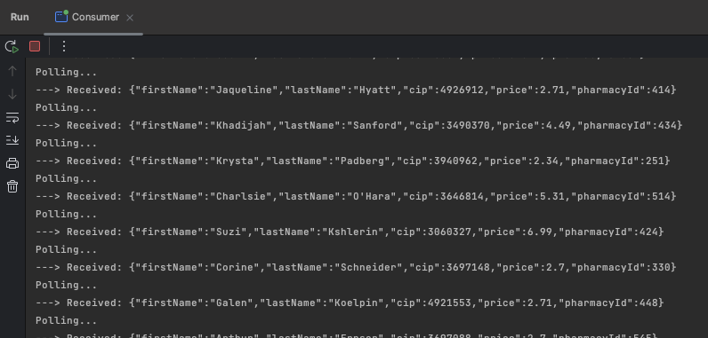 consumer

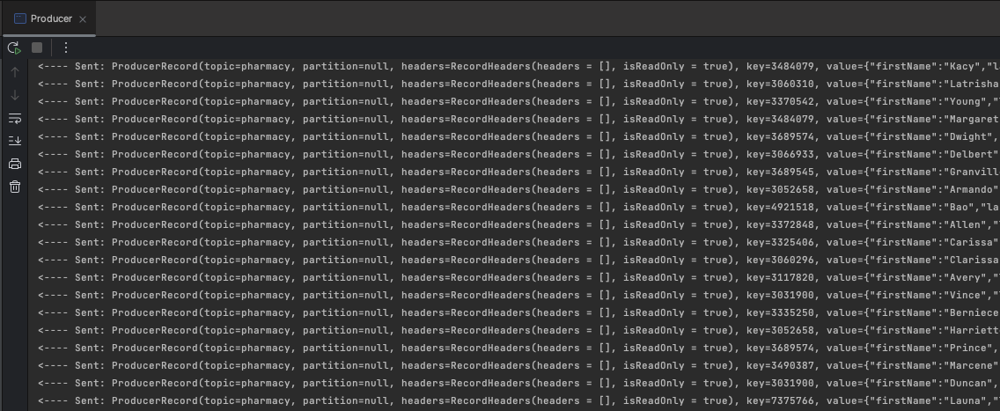 producer

J'ai aussi utilisé Offset Explorer pour voir les données.
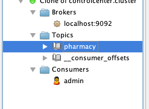

### 2. Avro

Topic section dans le control center de confluent **[localhost:9021](http://localhost:9021/)**
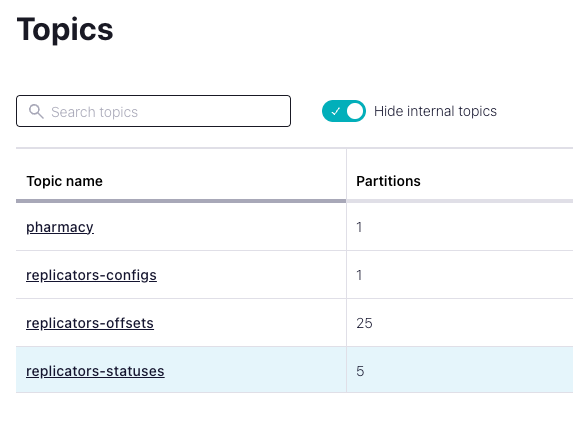

un example de données dans le topic **pharmacy**
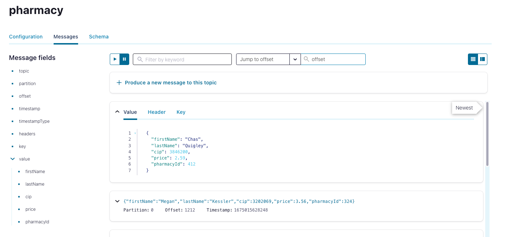

une capture d'écran de la console du consommateur dans le topic **pharmacy** avec le nom du groupe **admin**
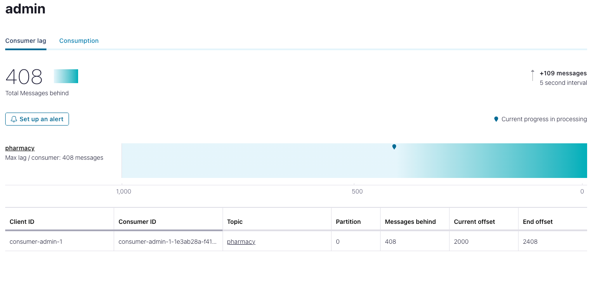

---

### 3. 3 brokers 3 partitions

#### 3.1 3 partitions avec un nouveau topic "medicine"

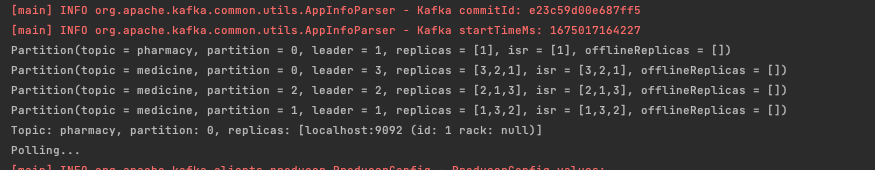

**medicine** créé avec 3 partitions par le consumer group **admin** qui consomme depuis trois partitions
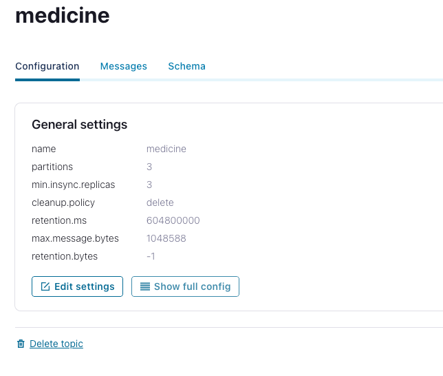

son group de consumer **group**

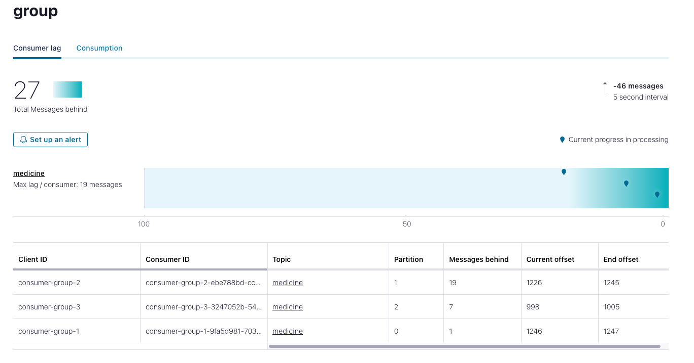

producer --> consumer(admin) --> consumer group

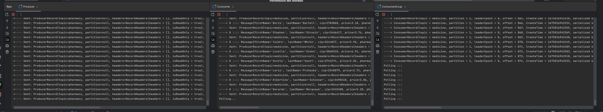

Comme montre la capture d'écran ci-dessus, le producteur envoie des données à un nœud Kafka, qui les stocke dans le topic **pharmacy**. Le consommateur de données avec le nom de groupe **admin** reçoit les données du nœud Kafka.
Et l'admin crée un nouveau topic **medicine** trois consomateur avec le nom **group**.
Le consommateur de données avec le nom de groupe **group** reçoit les données du nœud Kafka et les affiche.

---

# Kafka Streams

Cette partie m'a pris un peu plus de temps que prévu, mais après queues relise des cours j'ai réussi à implémenter une solution pour la suite des questions.

J'ai utilisé *confluent avro* pour cette partie au lieu de json (String).

Donc, J'ai du utilisé des configuration de Confluent pour faire fonctionner KStreams

```java
        Properties properties = loadProperties("streams");
        properties.put(StreamsConfig.DEFAULT_KEY_SERDE_CLASS_CONFIG, GenericAvroSerde.class);
        properties.put(StreamsConfig.DEFAULT_VALUE_SERDE_CLASS_CONFIG, GenericAvroSerde.class);
        properties.put("schema.registry.url", "http://localhost:8081");
```

Grâce à l'implementation de l'interface ```GenericRecord```  de la classe ```RecordGenerator```, Et

```java
        SpecificAvroSerde<RecordGenerator> recordGeneratorSerde = new SpecificAvroSerde<>();
```

, j'ai pu utiliser ces configurations pour utiliser KStream avec confluent Avro.

Pourquoi? Il existe plusieurs avantages d'utiliser avro confluent pour KStream

* Compatibilié
* Performances
* Sécurité
* Interopérabilité

J'ai deux claases Processors

un pour convertir les noms en *** => créer un nouveux topic 'secret_medicine'

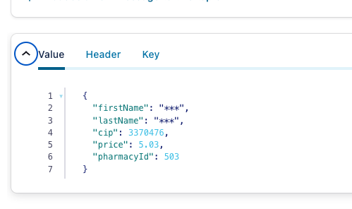

et la deuxième et pour filtrer les données ==> un nouveux topic 'exensive_medicine'

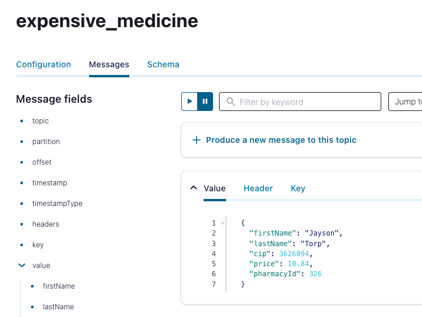

# Etapes pour lancer Avro Confluent

1. Lancer docker compose 2
2. Lancer Producer Main
3. Lancer Consumer Main
4. Lancer ConsumerGroup Main
5. Lancer SecretNameProcessor Main (pour la dernière partie)
6. Lancer ExpensiceMedicineProcessor Main (pour la dernière partie)

Note: Vous pouvez chnager le nom du topic dans l'appel

```
multiConsumer("medicine", 3);
``````

dans le Main de **ConsumerGroup** si vous voulez consommer les topic par exemple "secret", "expensive" pour voir les topic de sortie des processors :"SecretNameProcessor" et "ExpensiceMedicineProcessor"
